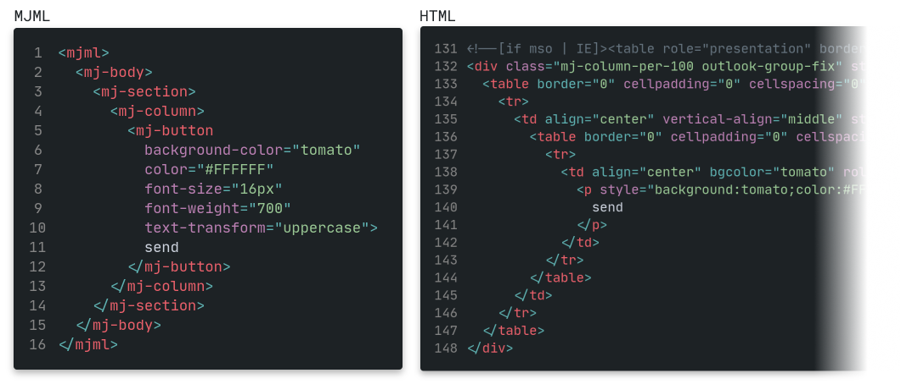
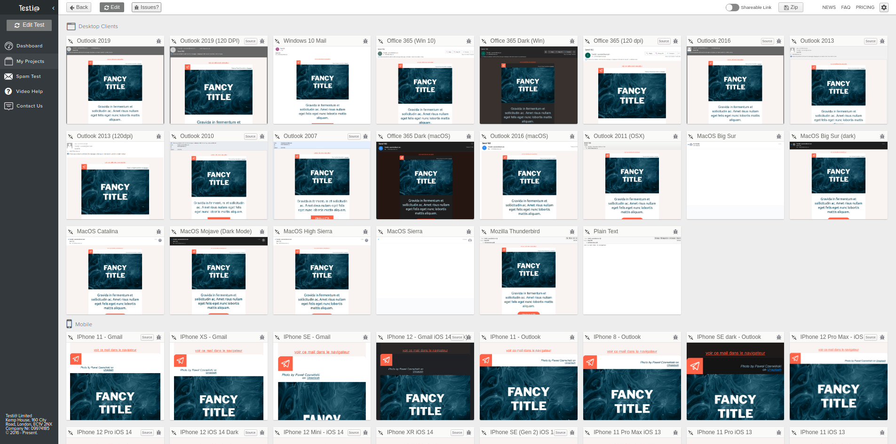

# Créer et tester des emails html

[création](#mjml) | [test](#testi)

## Ressources

<details>
<summary>+/-</summary>

- [emailclientmarketshare.com](http://emailclientmarketshare.com/) :bar_chart:
- [campaignmonitor.com/css/](https://www.campaignmonitor.com/css/) :vertical_traffic_light:
- [caniemail.com](https://www.caniemail.com/) :vertical_traffic_light:
- [templates.mailchimp.com](https://templates.mailchimp.com/) :bookmark_tabs:
- [mailjet.com/resources](https://www.mailjet.com/resources/) :bookmark_tabs:
- [litmus.com/resources](https://www.litmus.com/resources/) :bookmark_tabs:
- [emailonacid.com/resources](https://www.emailonacid.com/resources/) :bookmark_tabs:
- [reallygoodemails.com](https://reallygoodemails.com/) :art:
- [dribbble.com/stories](https://dribbble.com/stories/2020/12/03/email-design-tips) :art:

</details>

# MJML

MJML est un langage de balisage *open-source* créer par [Mailjet](https://www.mailjet.com/).  
Grâce à une syntaxe simple et un ensemble de composants, MJML permet de rapidement créer des emails HTML *responsive* et directement compatibles avec une grande majorité de clients mail.  
C'est le moteur MJML qui se charge de compiler le template en HTML.  



## Documentation

[https://documentation.mjml.io/](https://documentation.mjml.io/)

## Utilisation
<details>
<summary>MJML dispose de nombreuses options d'utilisations :</summary>

- [éditeur en ligne](https://mjml.io/try-it-live)
- [application desktop](https://mjmlio.github.io/mjml-app/)
- dans **VS Code** grâce à une [extension](https://github.com/mjmlio/vscode-mjml)
- en [ligne de commande](https://github.com/mjmlio/mjml/blob/master/packages/mjml-cli/README.md)
- dans [Node.js](https://documentation.mjml.io/#inside-node-js)
- [API](https://mjml.io/api) gratuite
- \+ les outils développés par la [communauté](https://mjml.io/community)...

</details>

:warning: Il est préférable de générer une version HTML *minifiée* car elle supprime les attributs `style` vides qui peuvent poser problème sur *Outlook*.

## En pratique

#### Structure :

```html
<!-- balise principale -->
<mjml>
  <!-- métadonnées + styles -->
  <mj-head>
    <!-- texte de l'onglet navigateur -->
    <mj-title></mj-title>
    <!-- texte d'aperçu dans la boite mail -->
    <mj-preview></mj-preview>
    <!-- attributs par défaut des balises MJML + class -->
    <mj-attributes>
      <mj-all padding="0" />
      <mj-text font-size="18px" line-height="24px" />
      <mj-class name="header" font-size="48px" />
    </mj-attributes>
    <!-- styles appliqués au HTML généré -->
    <mj-style>
      .primary div {
        color: tomato !important;
      }
    </mj-style>
  </mj-head>
  
  <!-- corps du mail -->
  <mj-body>
    <!-- division verticale -->
    <mj-section>
      <!-- division horizontale -->
      <mj-column>
        <mj-text mj-class="header">Hello World !</mj-text>
        <mj-text css-class="primary">Lorem ipsum dolor sit amet...</mj-text>
      </mj-column>
    </mj-section>
  </mj-body>
</mjml>
```
---

#### Style :

MJML va générer une structure de plusieurs éléments HTML en convertissant un composant.  
:warning: Une `<css-class>` est toujours appliquée à l'élément parent. Pour appliquer correctement un style il va donc parfois être nécessaire d'inspecter le code généré pour cibler le bon élément enfant.  
:warning: Comme les styles *inline* sont très utilisés dans les emails HTML il est indispensable de toujours ajouter `!important`.  

  
[specificity.mjml](./demo/specificity.mjml) : règles de spécificité.

---

#### Unitées :

La largeur des `<mj-column>` est en **pourcentages** (%) mais pour tout le reste il semble préférable de rester en **pixels** (px).  
Un exemple : *Outlook* va transformer un *padding* définit en pourcentages... en pouces, et d'une façon *étrange*.  
L'unité `em` peut également être utilisée sur tout les clients mail [(source)](https://www.caniemail.com/features/css-unit-em/).

---

#### Formats d'images :

- `.gif`(pas d'animation sur Outlook)
- `.png` (même avec alpha)
- `.jpeg`
- Pas de `.svg` :no_entry_sign:  
[source](https://www.caniemail.com/search/?s=image%20format)  

:warning: Donnez à chaque élément `<mj-image>` décoratif un attribut `alt` vide : `alt=""`

---

#### Responsive :

MJML met à disposition un composant `<mj-column>` au comportement *responsive*.  
Placés dans une `<mj-section>`, les `<mj-column>` se partagent sa largeur sur desktop et vont automatiquement s'empiler verticalement sur mobile. La largeur des `<mj-column>` est définie en pourcentage sans que la somme ne dépasse les 100%. Par défaut l'espace est réparti uniformément sur chaque `<mj-column>`.  
Un composant `<mj-group>` englobant des `<mj-column>` va annuler ce comportement responsive pour les grader côte à côte sur mobile.  

  
[columns.mjml](./demo/columns.mjml) : layout en 2 colonnes.

---

#### CSS Media query

Support : [plutôt bon](https://www.caniemail.com/features/css-at-media/).  
Il faut bien les placer dans une balise `<mj-style>` **SANS** l'attribut `<inline>`. Vous pouvez créer plusieurs balises `<mj-style>` dans `<mj-head>`.  
:warning: Utilisez la règle `!important` sur chaque propriété.

```html
<mj-head>
  ...
  <mj-style inline="inline">
    .mobile table {
      display: none !important;
      mso-hide: all;
    }
  </mj-style>

  <!-- mj-style SANS l'attribut inline -->
  <mj-style>
    @media (max-width: 480px) {
      .paragraph div {
        font-size: 16px !important;
        color: tomato !important;
      }
      .desktop table {
        display: none !important;
        mso-hide: all;
      }
      .mobile table {
        display: table !important;
      }
    }
  </mj-style>
</mj-head>
```

  
[media_query.mjml](./demo/media_query.mjml) : afficher/masquer des images différentes sur mobile et desktop et appliquer différents styles à un même élément.

---

#### Police distante

Support : [très mauvais](https://www.caniemail.com/features/css-at-font-face/).  
Utilisez la balise `<mj-font>` dans `<mj-head>` et pointez l'attribut `href` vers un fichier contenant la déclaration `@font-face` de la police (ex : [Creepster](https://fonts.googleapis.com/css2?family=Creepster)).

```html
<mj-head>
  ...
  <mj-font name="Creepster" href="https://fonts.googleapis.com/css2?family=Creepster" />
  ...
</mj-head>

<mj-body>
  ...
  <mj-section>
    <mj-column>
      <mj-text font-family="Creepster, sans-serif">
        custom font
      </mj-text>
    </mj-column>
  </mj-section>
  ...
</mj-body>
```

  
[custom_font.mjml](./demo/custom_font.mjml) : appliquer une police distante.

---

#### Image de fond (fenêtre client)

Support : bon... sauf sur Outlook (Windows) mais possibilité de faire mieux directement dans le html.  
Utilisez l'attribut `full-width="full-width"` sur la balise `<mj-wrapper>` et pointez l'attribut `background-url` vers le fichier image.

```html
  <mj-body>
    <mj-wrapper background-url="./assets/pattern.png" background-size="400px">
      ...
    </mj-wrapper>
  </mj-body>
```

  
[background_image.mjml](./demo/background_image.mjml) : appliquer une image de fond sur toute la fenêtre du client.

---

#### Exemple de *template* complet

  
[template.mjml](./demo/template.mjml) : template utilisant différents composants MJML.

---

# Testi@ 

Une fois le *template* généré il faut impérativement le tester et c'est ce que propose le site [testi.at](https://testi.at/) grâce à l'aperçu de plus de 90 clients mail sur desktop, mobile et webmail.  



## Utilisation